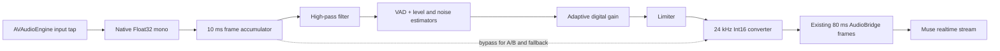

# Quiet-Speech Dictation for Dev

## Executive finding

Dev can improve recognition of softly spoken input without changing its stable macOS microphone topology. The most defensible solution is a provider-independent digital speech-leveling stage between microphone capture and Muse encoding, controlled by voice activity and noise estimates and followed by a limiter. The first implementation should use only automatic gain control and a high-pass filter. Echo cancellation and aggressive noise suppression should remain disabled unless transcription tests demonstrate a benefit.

Apple's `AVAudioEngine` voice-processing mode should not be used as Dev's default solution. Apple describes it primarily as a voice-over-IP and echo-cancellation feature that puts both the input and output nodes into voice-processing mode.^1 In Dev's live test, enabling it caused Core Audio to construct and repeatedly reconfigure aggregate input/output devices; dictation then stopped working. A recent Apple Developer Forums report documents the same aggregate-device failure class when input and output devices do not form a compatible pair.^2 The rollback restored dictation, confirming that the regression was in the capture topology rather than Muse or the push-to-talk state machine.

The recommended production candidate is WebRTC Audio Processing Module's AGC2, initially configured as a capture-only digital processor. WebRTC's implementation combines voice activity detection, speech-level estimation, noise-level estimation, saturation protection, adaptive gain and a limiter.^3 It accepts linear PCM in approximately 10 ms frames and exposes a float interface for arbitrary sample rates from 8 kHz to 384 kHz.^4 That allows Dev to preserve `AVAudioEngine` as a plain input source, run enhancement in application memory, and continue sending Muse the same 24 kHz mono Int16 stream.

Accuracy must be established with transcription results. Audio that sounds cleaner to a person can produce a worse transcript because enhancement may remove weak phonetic information or create artifacts. Recent ASR evaluations have found systematic recognition degradation after some denoisers even when signal-quality measures improved.^5 For that reason, the release gate should be word error rate, empty-transcript rate and normal-speech non-inferiority, rather than waveform appearance or perceived loudness.

## What Dev does today

The current capture implementation is small and direct:

1. `AudioCapture` obtains the default `AVAudioEngine.inputNode` and its hardware format.
2. An input tap receives buffers of 2,048 frames.
3. `AVAudioConverter` downmixes and converts the hardware signal directly to mono, interleaved, signed 16-bit PCM at the provider's sample rate.
4. Dev groups the result into 80 ms network frames.
5. `AudioBridge` retains up to 50 frames while Muse connects, then forwards the frames unchanged.
6. Muse receives `PCM_24KHZ` through its realtime WebSocket session.

The relevant code is in `Dev/Dictation/AudioCapture.swift`, `Dev/Dictation/AudioBridge.swift`, `Dev/Dictation/DictationController.swift`, and `Dev/Dictation/Transcription/Muse/MuseProvider.swift`. `AVAudioConverter` is an appropriate component for the existing format, bit-depth, interleaving and sample-rate conversion work.^6 There is currently no gain normalization, speech activity detection, noise measurement, compression or limiting in Dev.

This architecture has a useful property: capture does not depend on the output device. That is why it works across ordinary Mac configurations. The attempted Apple voice-processing change removed that property by activating a subsystem that expects input and output to participate together.

## Two different problems hidden by “whisper”

Soft speech and true whispered speech need to be treated separately.

**Soft phonated speech** retains vocal-fold vibration and most of the acoustic structure of normal speech, but reaches the microphone at a low digital level. A controlled gain stage can often help if the microphone captured the voice above its noise floor.

**True whispering** changes the speech signal itself. It lacks normal voicing and differs spectrally from phonated speech. Whispered-speech research consistently treats it as an acoustic-domain mismatch, not merely a low-volume recording. One evaluation of pretrained speech representations reported an 18.8% word error rate for its OpenAI Whisper baseline on whispered speech, and work using wTIMIT notes that whispered and normal speech differ substantially.^7 Amplification can make a whisper louder, but it cannot recreate missing pitch or voicing cues.

This distinction changes the product promise. Dev can reliably target “speak softly” with frontend level control. It should describe literal whisper support as experimental until Muse is evaluated on an actual whispered corpus.

## Why fixed amplification is insufficient

A fixed multiplier is attractive because it is easy to implement, deterministic and adds almost no latency. It is also a poor default across Mac microphones.

- A gain large enough to help a distant or quiet speaker also raises room tone, fans and keyboard noise.
- The same gain clips a user who moves closer or speaks normally.
- Applying a limiter after excessive fixed gain avoids numeric overflow but still compresses speech transients and can distort consonants.
- Raising silence can increase false speech detection and hallucinated partial transcripts.

Normalizing each short buffer independently has a related pumping problem: pauses become loud, word onsets receive a different gain from word endings, and the gain follows syllable energy rather than stable active-speech level. Speech-level measurement needs temporal context. ITU-T P.56 exists specifically to measure active speech level in a reproducible way,^8 while ETSI speech-test guidance uses approximately −26 dB overload as a nominal active level and warns that levels that are too low reduce signal-to-noise ratio while levels that are too high clip.^9

These standards are useful for measurement and fixture preparation. They do not by themselves specify a realtime AGC suitable for short push-to-talk utterances.

## Options assessed

| Approach | Quiet-speech potential | Recognition risk | Reliability in Dev | Integration cost | Recommendation |
|---|---:|---:|---:|---:|---|
| Apple voice-processing I/O | Medium | Medium | Low on mixed-device macOS setups | Low | Reject for default capture |
| Fixed digital gain | Medium | High across devices and rooms | High | Very low | Diagnostic baseline only |
| Handwritten RMS normalizer | Medium | Medium to high | High | Low | Prototype or fallback, not first production choice |
| RNNoise plus gain | Medium to high in stationary noise | Medium; may suppress weak whisper cues | High if embedded correctly | Medium | Evaluate later, after AGC-only baseline |
| WebRTC APM AGC2 only | High for low-level captured speech | Low to medium; controllable | High because it stays after capture | Medium to high | Preferred candidate |
| WebRTC AGC2 plus noise suppression | High in tested noise | Medium; over-suppression can harm ASR | High | Medium to high | Enable only if Muse WER improves |
| Whisper-to-normal neural conversion | Potentially high for true whispers | Model/domain dependent | Separate heavy subsystem | Very high | Research track, outside first release |

RNNoise is a credible small noise-reduction component and is designed for realtime, full-band speech at 48 kHz.^10 It is not an automatic gain controller, and its perceptual denoising objective does not guarantee better Muse transcripts. It is therefore a later experiment, not a substitute for speech-level control.

## Recommended architecture

### Preserve capture topology

`AVAudioEngine` should continue to expose only the default input node and tap. Dev should not activate Apple's voice-processing I/O, create an aggregate device, change system input volume, or depend on the default output route. A processor failure must switch to raw passthrough for the current session rather than fail dictation.

### Process before final Int16 conversion

The processor should work on mono Float32 samples in the range −1 to 1. This avoids repeated integer quantization while filters and gain are applied. After processing, the existing converter can produce the exact 24 kHz Int16 format Muse already accepts.

WebRTC APM works on approximately 10 ms frames and can process float PCM at arbitrary supported rates.^4 Dev's current 80 ms network framing should remain unchanged; a new accumulator can divide capture audio into 10 ms processing frames, then combine the result into the existing 80 ms transport frames. The processing layer should stay independent of `MuseProvider` so future providers receive the same tested input behavior.

### Start with AGC2, a limiter and a high-pass filter

The initial configuration should be deliberately narrow:

- Enable AGC2 adaptive digital control.
- Disable AGC2 input-volume control so Dev never changes the Mac or device's hardware gain.
- Enable the limiter.
- Enable a conservative high-pass filter to remove DC and low-frequency handling noise.
- Disable echo cancellation because Dev does not play remote speech that must be subtracted.
- Disable noise suppression in the first accuracy trial.
- Preserve a raw bypass path selectable by an internal feature flag.

WebRTC's current AGC2 defaults illustrate the safeguards a production controller needs: headroom, bounded maximum gain, bounded gain change per second, a maximum output noise level, a VAD, noise-level estimation and saturation protection.^3 These mechanisms are materially safer than choosing gain from a single RMS value.

The upstream default allows a large 50 dB maximum adaptive gain and begins at 15 dB.^4 Dev should not adopt those values blindly. For a first Muse experiment, test maximum gains of 6, 12 and 18 dB, initial gains of 0 and 6 dB, and a noise-output ceiling around −50 dBFS. The winning configuration must be selected by transcript metrics across devices, not intuition.

### Keep noise suppression a separate experiment

Noise removal and quiet-speech gain solve different problems. The weak voice may already be clean; applying denoising in that case can remove low-energy consonants. Evidence from modern zero-shot ASR shows that perceptually improved audio can have worse word and character error rates,^5 and other work attributes ASR degradation to enhancement artifacts and false deletions.^11

If the AGC-only version still performs poorly beside a fan or keyboard, test low and moderate WebRTC noise-suppression settings as separate variants. Do not bundle noise suppression with AGC in the first experiment because the result would not reveal which stage helped or harmed recognition.

## Accuracy validation

### Corpus

Use three complementary sources:

1. **Personal Dev corpus:** 50–100 representative commands and prose passages recorded by the primary user with normal, soft-phonated and true-whisper delivery. This is the most relevant evidence for the product's immediate use.
2. **Device corpus:** Repeat a smaller fixed script on the Mac's built-in microphone, AirPods or Bluetooth input, and any external microphone used in practice.
3. **Public whisper corpus:** Use licensed samples from wTIMIT or CHAINS where available. CHAINS explicitly includes a whisper speaking condition.^12 This tests generalization but should not replace personal data because its accents, microphones and room conditions differ.

Audio should be captured once as raw Float32 and replayed through each candidate frontend. This ensures every A/B variant receives identical speech and noise. Test fixtures may be retained only with explicit opt-in; normal Dev usage should continue storing aggregates and never audio or transcripts.

### Conditions

Each spoken set should cover:

- Normal speech at the current comfortable distance.
- Soft phonated speech at the same distance.
- True whisper at the same distance.
- Quiet room tone.
- Steady fan noise.
- Keyboard transients.
- Low background speech or music.
- A sudden change from soft to normal volume within one utterance.

Prepare level-controlled copies spanning roughly −26, −36, −46 and −56 dB active speech. P.56-style active-speech measurement is preferable to whole-file RMS because pauses otherwise dominate the number.^8

### Metrics

The main metric is normalized word error rate. Also record:

- Character error rate for names and short phrases.
- Empty-result rate.
- False-transcript rate on room tone.
- Deletion, insertion and substitution counts.
- Time to first partial and time to final transcript.
- Input and output active-speech level.
- Input and output noise level.
- Applied gain over time.
- Percentage of clipped or limiter-affected samples.
- Capture-start failure rate across repeated sessions.

Waveform loudness, PESQ-like quality and listener preference are secondary. The product outcome is the transcript.

### Release gates

A sensible first release gate is:

- Zero microphone-start regressions across at least 100 rapid start/stop sessions on every available device route.
- No more than one absolute percentage point of WER regression on normal speech.
- At least 15% relative WER improvement, or a large reduction in empty results, on soft phonated speech.
- No increase in false transcripts on silence.
- No unhandled processing errors; raw passthrough must remain operational.
- No measurable change to the existing hotkey, insertion or repeat-dictation state machine.

True-whisper improvement should be reported separately. A gain layer may pass every soft-speech gate and still fail literal whispers because the ASR model lacks the right acoustic invariance.

## Implementation plan

### Phase 1: Measurement and replay harness

Extract the audio framing boundary behind a small `AudioProcessor` protocol with `process(frame:)` and `reset()` methods. Add a passthrough implementation first. Build a local command-line or test-target replay harness that reads PCM fixtures, applies a processor and submits both raw and processed variants to Muse. Record transcripts and timing in test output rather than production storage.

This phase should ship no behavior change. It creates the evidence needed to choose a processor and prevents another microphone-topology regression from being mistaken for a model problem.

### Phase 2: AGC-only experiment

Integrate a pinned WebRTC APM build behind an Objective-C++ wrapper with a narrow C or Swift-facing interface. Enable high-pass filtering, AGC2 adaptive digital gain and the limiter. Keep input-volume control, echo cancellation and noise suppression disabled. Process 10 ms Float32 mono frames and expose only aggregate diagnostics.

Run the complete A/B matrix and select parameters using the release gates. Do not turn the feature on by default until raw and processed paths have been compared on identical recordings.

### Phase 3: Guarded rollout

Ship the validated processor behind an internal preference and retain instant raw fallback. During startup, allocate and initialize the processor before microphone capture. During a session, any non-success processing result should bypass the remaining frames rather than end dictation. Reset all filter, VAD and gain state between push-to-talk sessions.

Once the normal-speech non-inferiority and soft-speech gains hold in daily use, make automatic enhancement the default. A user-facing control is unnecessary unless hardware-specific failures appear; an internal bypass is still essential for diagnosis.

### Phase 4: Noise and true-whisper research

Evaluate WebRTC noise suppression at low and moderate levels as independent A/B variants. Test RNNoise only if it materially outperforms WebRTC's suppressor on Muse WER. For literal whispers, first benchmark Muse with level-matched raw audio. If errors persist after good level control, investigate a provider with demonstrated whispered-speech performance or a whisper-to-normal conversion model. That is a model-selection problem rather than a gain-tuning problem.

## Engineering impact

Dev currently has no remote package dependencies and its debug app bundle is approximately 4.2 MB. A full WebRTC binary would increase build complexity and bundle size substantially relative to the current app, although the exact increase depends on how narrowly the audio-processing targets are built and stripped. A handwritten Swift leveler would preserve the small bundle but would require Dev to own VAD, noise estimation, gain adaptation, saturation protection and long-term tuning.

The recommended tradeoff is to prototype with the mature WebRTC algorithms, then measure the actual binary and CPU cost. If distribution size is unacceptable, the test harness and selected parameters can guide a smaller purpose-built implementation. Starting with an unvalidated custom AGC would save integration work while transferring the harder accuracy and edge-case burden into the app.

CPU and latency should be measured on the oldest supported Mac. APM is designed for realtime communications and 10 ms processing,^4 so it is structurally compatible with Dev's latency budget, but local measurements remain necessary. The processor must avoid allocation, locks, UI calls and logging on the realtime audio callback.

## Recommendation

Proceed with a measurement-first WebRTC AGC2 prototype that never touches the system audio route. Preserve `AVAudioEngine` capture exactly as it works today, insert a bypassable 10 ms Float32 processing stage, and choose gain parameters from Muse WER on normal and soft speech. Keep denoising off until it proves beneficial. Treat true whispered speech as a separate ASR capability test.

This approach directly addresses the observed failure, minimizes the chance of another dictation outage, and defines “accurate” in terms of the text Dev inserts.

## Sources

1. Apple. “[What's New in AVAudioEngine](https://developer.apple.com/videos/play/wwdc2019/510/).” WWDC 2019. Voice processing is described as a VoIP/echo-cancellation path involving both I/O nodes.
2. Apple Developer Forums. “[AVAudioEngine Voice Processing Fails with Mismatched Input/Output Devices: AggregateDevice Channel Count Mismatch](https://developer.apple.com/forums/thread/810129).” December 2025. Corroborating field report; not an authoritative platform guarantee.
3. WebRTC Project. “[GainController2](https://webrtc.googlesource.com/src/+/refs/heads/main/modules/audio_processing/gain_controller2.h).” Current source tree. Component structure including VAD, noise and speech-level estimation, saturation protection and limiter.
4. WebRTC Project. “[Audio Processing API](https://webrtc.googlesource.com/src/+/refs/heads/main/api/audio/audio_processing.h).” Current source tree. Frame duration, formats, supported rates and AGC2 configuration.
5. Islam, Akif; Nahar, Raufun; Hamid, Md. Ekramul. “[When Denoising Hinders: Revisiting Zero-Shot ASR with SAM-Audio and Whisper](https://arxiv.org/abs/2603.04710).” 2026.
6. Apple. “[AVAudioConverter](https://developer.apple.com/documentation/avfaudio/avaudioconverter).” Current developer documentation.
7. Farhadipour, Aref; Asadi, Homa; Dellwo, Volker. “[Leveraging Self-Supervised Models for Automatic Whispered Speech Recognition](https://arxiv.org/abs/2407.21211).” 2024; and Lin, Zhaofeng; Patel, Tanvina; Scharenborg, Odette. “[Improving Whispered Speech Recognition Performance using Pseudo-whispered based Data Augmentation](https://arxiv.org/abs/2311.05179).” 2023.
8. ITU-T. “[Recommendation P.56: Objective measurement of active speech level](https://www.itu.int/ITU-T/recommendations/rec.aspx?rec=11461).” Current recommendation series; 2026 edition listed as in force.
9. ETSI. “[TR 103 138 V1.5.1: Speech samples and their use for QoS testing](https://www.etsi.org/deliver/etsi_tr/103100_103199/103138/01.05.01_60/tr_103138v010501p.pdf).” 2018.
10. Xiph.Org Foundation. “[RNNoise](https://github.com/xiph/rnnoise).” Official source repository; based on J.-M. Valin, “A Hybrid DSP/Deep Learning Approach to Real-Time Full-Band Speech Enhancement.”
11. Microsoft Research. “[Effect of Noise Suppression Losses on Speech Distortion and ASR](https://www.microsoft.com/en-us/research/wp-content/uploads/2022/07/0000996.pdf).” 2022.
12. Linguistic Data Consortium. “[The CHAINS Speech Corpus](https://catalog.ldc.upenn.edu/LDC2008S09).” LDC2008S09; includes a defined whisper condition.
